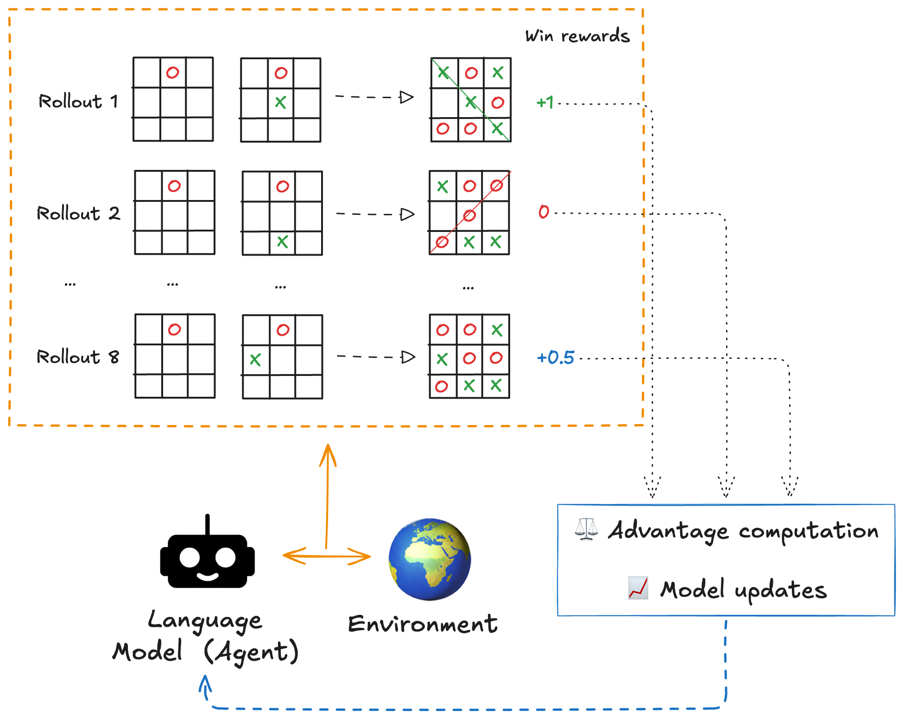

# Reinforcement Learning

In the previous chapter, we taught our small model to follow the format expected by our game (`"<think>...</think><move>...</move>"`). While SFT training worked, the model is still far from perfection.

It is time to use our environment to make our small model master Tic Tac Toe via Reinforcement Learning.

Verifiers supports various training backends including PRIME-RL (a framework for large-scale async reinforcement learning) and `vf.RLTrainer`, a minimal, simplified version of PRIME-RL.

*In this chapter, we use `vf.RLTrainer` as in my experiments, but I recommend switching PRIME-RL for better performance and more full-fledged features.*

Speaking of RL algorithms, `RLTrainer` uses async CISPO with one-step off-policy overlap. Before diving into training,
let's do a recap of how these algorithms work.

## GRPO/CISPO recap

To get a feel for the process, let's quickly recap how Group Relative Policy Optimization works in a multi-turn game like this.
We'll consider the case of Reinforcement Learning with Verifiable Rewards, where we have a deterministic function (not another model) to compute rewards.

1. Rollouts: Starting from the same initial board, the model plays several games via LLM sampling.
2. Each rollout is evaluated using deterministic reward functions (win, format, invalid moves).
3. An average score is calculated across the group of rollouts.
4. Each rollout is then compared against this average (advantage computation).
5. The model is updated to favor trajectories that did better than the group baseline.



For a deeper explanation of GRPO, check out the [Hugging Face LLM course](https://huggingface.co/learn/llm-course/en/chapter12/3).

CISPO, used in `RLTrainer`, is a refinement of GRPO, introduced in the [MiniMax-M1 paper](https://arxiv.org/abs/2506.13585). Unlike GRPO, which clips large policy ratios and may suppress learning from rare but critical tokens, CISPO (Clipped IS-weight Policy Optimization) clips importance weights instead. This preserves these learning signals and improves training efficiency.

## `vf.RLTrainer` configuration

`vf.RLTrainer` requires a TOML configuration file.

Below are the key parts of the configuration I used (full version [here](../training_configs/vfrltrainer_rl1.toml)).

```toml
model = "anakin87/LFM2-2.6B-ttt-sft"

[env]
id = "anakin87/tictactoe"

[env.args]
min_random_move_prob = 0.2
max_random_move_prob = 0.7
max_turns = 7
num_examples = 19200
num_groups = 32

[inference]
gpus = 1

[inference.args]
enforce_eager = true

[trainer]
gpus = 1

[trainer.args]
run_name = "tictactoe"
use_liger = false

# Batch configuration
micro_batch_size = 8
rollouts_per_example = 8
batch_size = 256

max_tokens = 128
max_seq_len = 768  # Sequence length: max tokens for full conversation (prompt + all turns)

max_steps = 600

learning_rate = 5e-5

# Hub configuration
push_to_hub = true
hub_model_id = "anakin87/LFM2-2.6B-ttt-rl"
hub_strategy = "every_save"
save_strategy = "steps"
save_steps = 5
save_total_limit = 1
```

The [Verifiers docs](https://docs.primeintellect.ai/verifiers/training) offer a good guide to the training configurations. Here, I'll comment on the most relevant parts.

RL training involves repeated inference and weight updates, so it's natural to dedicate some GPUs to model serving (via vLLM) and others to training. In the configuration above, we use one for inference and one for training.
In particular, I used two NVIDIA RTX Pro 6000 with 96 GB VRAM, available on Prime Intellect. By tuning the parameters
described below, you can use smaller GPUs.

- In `[env.args]`, we specify how the environment is instantiated.

  - We set `min_random_move_prob = 0.2` and `max_random_move_prob = 0.7`: this makes sure that the model faces opponents
where the probability of making a random move varies from 20% to 70%. We have neither purely random players nor purely optimal players: a good playground to get signal and learn both attack and defense.

  - `num_groups` for Stratified Sampling is set to `batch_size // rollouts_per_example`. To better understand the role of
  this configuration, see [chapter 3](03.md).

- `[trainer.args]` contains parameters related to the training loop.
  -`use_liger = false`. By default, Verifiers use Liger Kernel for training optimization but
  Liquid models have a unique architecture that isn't supported yet.

  - `rollouts_per_example`: GRPO group size. Values between 8 and 32 are typically recommended to ensure sufficient reward diversity.
  - `micro_batch_size`: The number of rollouts processed per GPU during a single forward/backward pass.
  - `batch_size`: total rollouts per training step. It must be a multiple of `micro_batch_size * num_training_gpus * rollouts_per_example`.
  - `lora_rank`. By default, Verifiers uses [LoRA](https://arxiv.org/abs/2106.09685) to save memory.

  - `max_seq_len`: max tokens for full conversation (prompt + all turns). Longer sequences are truncated.

  - `max_tokens`: max tokens per turn generated by vLLM. This is not a training parameter per se, but it should be chosen consistently with `max_seq_len`.

  - We also set several parameters related to Hugging Face Hub configuration. While not documented, the RL trainer configuration inherits from [`transformers.TrainingArguments`](https://huggingface.co/docs/transformers/v4.57.3/en/main_classes/trainer#transformers.TrainingArguments), which allows fine-grained control over model publishing and saving frequency.

Verifiers / PRIME-RL Config,Hugging Face Transformers Concept
micro_batch_size,per_device_train_batch_size
batch_size,Global / (Calculated Automatically)
(Calculated Automatically),gradient_accumulation_steps

During our RL training, we want effective learning and at the same time, utilizing our GPUs fully without crashing. Let's
discuss these aspects.

### GPU memory optimization

Given certain machines, the goal here is to use as much GPU VRAM as possible without hitting an Out of Memory (OOM) error.

For inference, vLLM generally takes care well and we don't need to worry.

For training, these parameters dictate how much VRAM you use. If you crash, tune these.

- `micro_batch_size`: The number of rollouts processed per GPU during a single forward/backward pass. This is the main driver of peak GPU memory usage. Setting it to lower values does not impact learning efficacy, but it makes training slower.

- `max_seq_len`: The maximum total tokens (prompt + completion). Attention memory scales quadratically with this.

- `lora_rank`. Higher ranks consume more memory. Interestingly, [Thinking Machines](https://thinkingmachines.ai/blog/lora) recently showed that for RL, LoRA works just as well as full fine-tuning, even with a rank as low as 1.

How to find a config that fully uses GPU without going Out Of Memory?
I suggest this practical walkthrough:

1. Set `rollouts_per_example` to 8 (or 16) and `micro_batch_size` to 1.
2. Set `batch_size` to the minimum valid value (`rollouts_per_example` * `num_training_gpus` * `micro_batch_size`). This lets you jump straight into the training loop to see if the GPU crashes immediately.
3. Gradually increase `micro_batch_size` until you hit an OOM, then back off by one.
4. For real training, increase `batch_size` to a larger value to increase training stability.

### Training stability and effectiveness

RL training is sensitive hyperparameters and can be unstable. For useful suggestions on this topic, I recommend
[Verifiers documentation](https://docs.primeintellect.ai/verifiers/training).

I learnt the hard way that `batch_size` is a key parameter. In this environment, I observed unstable training and model collapse when experimenting with values lower than 256.

The explanation is intuitive: `batch_size` is the number of games used to do model's weight updates.
If this number is low (e.g. 16), this means learning to play from a very small number of matches (and type of opponents) at a time
and this likely leads to supobtimal strategies.